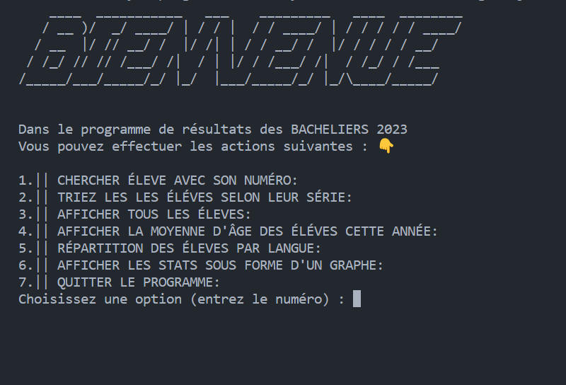

# Projet Baccalauréat 2023 aux Comores (île de Ngazidja)
# analyse-resultats-bac-2023-ngazidja

Ce projet est une application Python pour manipuler les données du baccalauréat 2023 aux Comores, en particulier sur l'île de Ngazidja. Voic les fonctionnalités de l'application:

Analyse des résultats du baccalauréat 2023 aux Comores, sur l'île de Ngazidja
Ce dépôt contient un programme Python qui permet d'analyser les données CSV des résultats du baccalauréat 2023 aux Comores, sur l'île de Ngazidja.

Installation
Pour installer ce programme, suivez les étapes suivantes :

1. Clonez le dépôt GitHub :
git clone https://github.com/Kymhd/analyse-resultats-bac-2023-ngazidja--Comores-.git

2. Installez les dépendances :

``pip install -r requirements.txt``

## Démarrage du projet

Pour démarrer ce projet, vous devez :

- Exécuter le fichier `main.py` avec la commande `python main.py`
- Choisir une option dans le menu affiché à l'écran
- Suivre les instructions à l'écran pour chaque option

Le programme vous présentera un menu avec les différentes fonctionnalités disponibles. Sélectionnez l'option souhaitée en entrant son numéro.

Fonctionnalités
Le programme propose les fonctionnalités suivantes :

Recherche d'un étudiant par son numéro
Tri des étudiants par série
Affichage de tous les étudiants
Affichage de la moyenne d'âge des étudiants
Affichage d'un graphique de la répartition des étudiants par série
Affichage d'un graphique de la répartition des étudiants par langue

## Contribution au projet

Ce projet est un travail personnel et n'accepte pas de contributions externes pour le moment. Si vous avez des suggestions ou des remarques, vous pouvez me contacter par e-mail à mahabamema15@gmail.com .

### Remarques

Ce programme est un travail personnel et n’a pas de vocation commerciale. Les données utilisées sont réelles, mais leur usage est restreint. Je précise que je les ai trouvées sur Internet, et qu’elles contiennent des informations personnelles sensibles. Leur usage ne doit pas être abusif ni dépasser un cadre éducatif. Enfin, je tiens à signaler que je n’ai aucun droit sur ces données.

